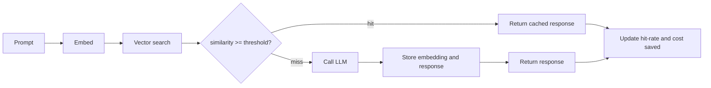

# llm-semantic-cache

> Stop paying the model to answer the same question twice

[](https://python.org)
[](LICENSE)
[](https://github.com/Krishna89287/llm-semantic-cache/actions)

An exact-match cache barely helps with LLM traffic. "How do I reset my password?"
and "How can I reset my password?" are the same question, but a string key sees
two different prompts and pays for two completions.

This caches by similarity instead. A new prompt is embedded and compared to what
has already been answered. If the closest match is similar enough, you get the
cached response in well under a millisecond instead of a model call. If nothing
is close, the model runs and the answer is stored for next time. Entries expire
on a TTL and evict LRU, so memory stays bounded.

## What it looks like running

```
$ make demo
  MISS  sim=0.000    55.2ms  How do I reset my password?
  HIT   sim=0.832     0.1ms  How can I reset my password?
  MISS  sim=-0.018    55.1ms  What is your refund policy?
  MISS  sim=0.552    55.0ms  Tell me about your refund policy
  HIT   sim=1.000     0.4ms  How do I reset my password?
  MISS  sim=0.353    55.3ms  What are your business hours?
  MISS  sim=0.310    52.2ms  When are you open?
  HIT   sim=0.832     0.7ms  How can I reset my password?

lookups=8  hits=3  hit_rate=38%
tokens saved=33  est cost saved=$0.0165
```

The model here is a stand-in that sleeps 50ms. On a hit the cache answers in
under a millisecond, so the saving shows up in both latency and cost.

## A note on "semantic"

The default embedder is a local feature-hashing vectorizer. It needs no API key
and is deterministic, and it is good at catching rewordings that share words or
character patterns. You can see it work above: the password rewording scores
0.832 and hits.

What it does not do is match meaning across different words. "When are you open?"
scores 0.310 against "What are your business hours?" and misses, because they
share almost no surface text. If you want those to hit, implement the small
`Embedder` interface with sentence-transformers or a hosted embedding endpoint
and pass it in. The cache, similarity search, TTL, eviction, and accounting stay
exactly the same. See [`embedder.py`](src/llm_semantic_cache/embedder.py).

## How it flows



## Getting started

```bash
git clone https://github.com/Krishna89287/llm-semantic-cache
cd llm-semantic-cache
pip install -r requirements-dev.txt

make demo      # run the prompt stream above
make test      # full test suite
make run       # serve the API on :8000
```

Use it in code:

```python
from llm_semantic_cache.cache import SemanticCache

cache = SemanticCache(threshold=0.8, ttl=3600, cost_per_1k=0.5)

def ask(prompt: str) -> str:
    result = cache.get_or_call(prompt, your_llm_client)
    return result.response  # result.cached tells you if it came from cache
```

## Tuning

| Knob          | Effect                                                              |
| ------------- | ------------------------------------------------------------------ |
| `threshold`   | Higher is stricter. Too low returns wrong answers, too high never hits |
| `ttl`         | How long an answer stays valid before it must be regenerated       |
| `max_size`    | Cap on cached entries before LRU eviction kicks in                 |
| `cost_per_1k` | Your blended token price, used only for the saved-cost estimate    |

**Stack:** Python · FastAPI · Pydantic · feature hashing · cosine similarity

---

Built by [Krishna Gove](https://github.com/Krishna89287), working on AI and cloud infrastructure in Munich.
